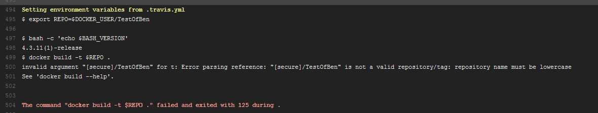
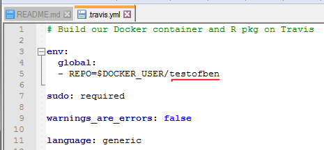

<!-- This is the format for text comments that will be ignored during renderings. Do not put R code in these comments because it will not be ignored. -->

```{r, setup, echo = FALSE}
knitr::opts_chunk$set(
  collapse = TRUE,
  warning = FALSE,
  message = FALSE,
  echo = FALSE,
  comment = "#>",
  fig.path = "figures"
)

library(TestOfBen)
```

# Introduction

Ben Marwick recommends the usuage of RStudio using his [rrtools](https://github.com/benmarwick/rrtools). As Daniel Knitter has shown in his [RRREmacs](http://htmlpreview.github.io/?https://github.com/dakni/EmacsEssay/blob/master/analysis/paper/paper.html) package, also Emacs can be the medium to use rrtools. Since I like to work with Tinn-R I tested rrtools using this environment.   


# First steps
At first I simply followed the steps explained in the [rrtools](https://github.com/benmarwick/rrtools) readme file, beginning with the definition of my working directory and the installation of rrtools.


```{r demo, eval = FALSE, echo = TRUE}
setwd("E:/FilePath")

devtools::install_github("benmarwick/rrtools")

```

Then I went on creating the specific R package files with the rrtools and devtools methods. 

```{r eval = FALSE, echo = TRUE}

rrtools::use_compendium("TestOfBen")

devtools::use_mit_license(copyright_holder = "Wolfgang Hamer")

#Token:  https://github.com/settings/tokens
devtools::use_github(".", auth_token = "xxxxx", protocol = "https", private = FALSE)

rrtools::use_readme_rmd()

rrtools::use_analysis()

rrtools::use_dockerfile()

rrtools::use_travis()
```

At first the travis test would not pass, since the package name contained large letters:

 

The problem could be solved quite easily by changing the entry in the travis.yml file:

 
 

# Build

Afterwards I could build the package and install it:

```{r eval = FALSE, echo = TRUE}
devtools::build()

devtools::install()
```

Then I could render the .Rmd files:

```{r eval = FALSE, echo = TRUE}
rmarkdown::render("analysis/paper/paper.Rmd") 
```
and push the whole thing on my GitHub Account using the commands in the terminal:

- _git status_
- _git add ._
- _git commit -m "What was changed"_
- _git push_

### Colophon

This report was generated on `r Sys.time()` using the following computational environment and dependencies: 

```{r colophon, cache = FALSE}
# which R packages and versions?
devtools::session_info()
```


